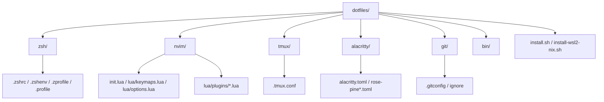

# Antigravity.md - Dotfiles Codebase Guide

This file provides context and instructions specifically tailored for **Antigravity** (your AI coding assistant) to understand and interact with this dotfiles repository.

---

## 📂 Repository Structure

The repository is organized by component directories that map directly to config locations on the system:



*   **[zsh/](file:///Users/venkata_subash/dotfiles/zsh)**: Zsh configuration files (`.zshrc`, `.zshenv`, `.zprofile`, `.profile`).
*   **[nvim/](file:///Users/venkata_subash/dotfiles/nvim)**: Neovim setup using Lazy.nvim. Plugins are structured as one-file-per-plugin in `nvim/lua/plugins/`.
*   **[tmux/](file:///Users/venkata_subash/dotfiles/tmux)**: Tmux configuration using TPM (Tmux Plugin Manager).
*   **[alacritty/](file:///Users/venkata_subash/dotfiles/alacritty)**: Alacritty terminal emulator settings and themes.
*   **[git/](file:///Users/venkata_subash/dotfiles/git)**: Git global configuration and ignores.
*   **[bin/](file:///Users/venkata_subash/dotfiles/bin)**: Custom automation shell scripts (e.g. `flow`).

---

## 🎨 Design System & Theme

*   **Primary Theme:** **Rose Pine** (`main` variant) is used globally across Neovim, Alacritty, and Tmux to maintain visual cohesion.
*   **Aesthetics:** Dark mode, clean, distraction-free.

---

## ⚙️ Installation & Symlinking

Installation is orchestrated through symlink-creation shell scripts:
*   **macOS Setup:** Runs `./install.sh` which installs Homebrew, required CLI tools/casks, sets up TPM, and creates symlinks.
*   **WSL2/Linux Setup:** Runs `./install-wsl2-nix.sh` using Nix packages.

### Symlink Mappings
| Source Path | Target System Path | Description |
| :--- | :--- | :--- |
| `zsh/.zshrc` | `~/.zshrc` | Shell startup script |
| `zsh/.zshenv` | `~/.zshenv` | Environment variables |
| `git/.gitconfig` | `~/.gitconfig` | Global git configuration |
| `git/ignore` | `~/.config/git/ignore` | Global git ignore rules |
| `alacritty/` | `~/.config/alacritty/` | Alacritty configurations and themes |
| `nvim/` | `~/.config/nvim/` | Entire Neovim config |
| `tmux/.tmux.conf` | `~/.tmux.conf` | Tmux mappings and plugins |
| `bin/flow` | `~/.local/bin/flow` | Custom tmux automation script for dynamic workspace setup |

---

## 🛠️ Build, Test & Linting Reference

### Installation / Setup
*   **Run installer:**
    ```bash
    ./install.sh
    ```

### Shell Validation
*   **Lint scripts:**
    ```bash
    shellcheck install.sh zsh/.zshrc
    ```
*   **Test shell loading:**
    ```bash
    zsh -c "source zsh/.zshrc"
    ```

### Neovim Configuration
*   **Test plugin loading without opening the UI:**
    ```bash
    nvim --headless -c "Lazy" -c "qa!"
    ```
*   **Sync plugins:**
    ```bash
    nvim --headless -c "Lazy sync" -c "qa!"
    ```
*   **Lint Lua files:**
    ```bash
    luacheck nvim/init.lua nvim/lua/
    ```
*   **Format Lua files:**
    ```bash
    stylua nvim/
    ```

### Tmux Configuration
*   **Source updated config:**
    ```bash
    tmux source-file ~/.tmux.conf
    ```

---

## 📝 Code Modification Rules for Antigravity

When editing files in this codebase, adhere strictly to the following instructions:

1.  **Safety & Backups:** Use the custom `link()` function in `./install.sh` when managing symlinks to avoid overwriting user data without creating a backup (`.bak`).
2.  **Modular Neovim Plugins:** Place every Lazy.nvim plugin configuration inside its own dedicated file under `nvim/lua/plugins/` (e.g. `nvim/lua/plugins/telescope.lua`). Never put raw plugin configurations in `nvim/init.lua` directly.
3.  **Local Variables:** Always use the `local` keyword inside Lua and Shell script functions to prevent scope pollution.
4.  **Error Handling:** Use `pcall` in Neovim Lua scripts when requiring other modules to prevent startup crashes.
5.  **Maintain Rose Pine theme:** Any visual tweaks to tmux status bar, terminal colors, or UI prompts must respect the Rose Pine color palette.
